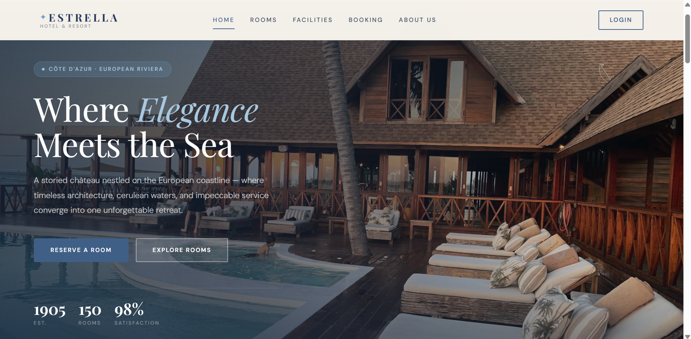
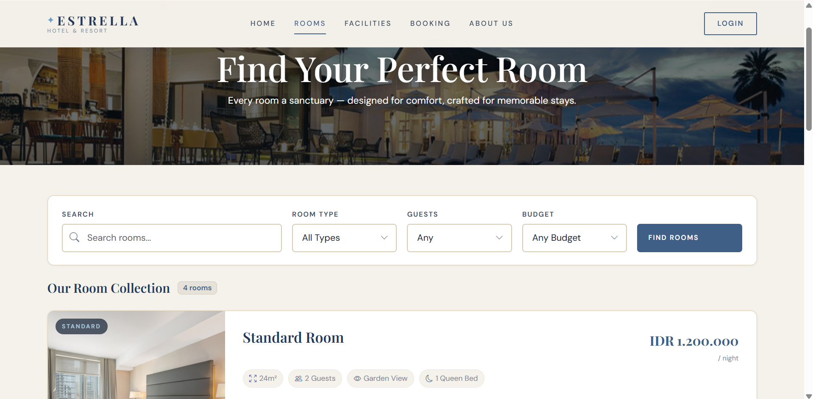
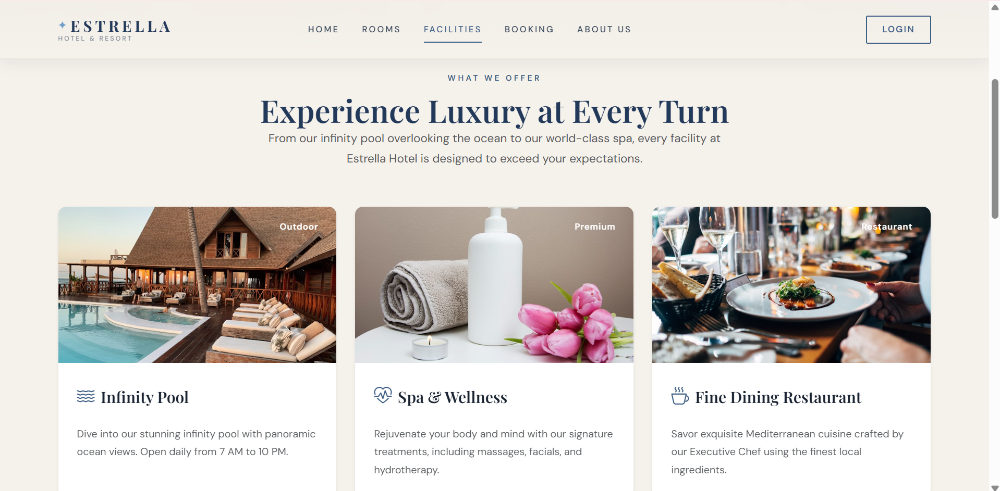
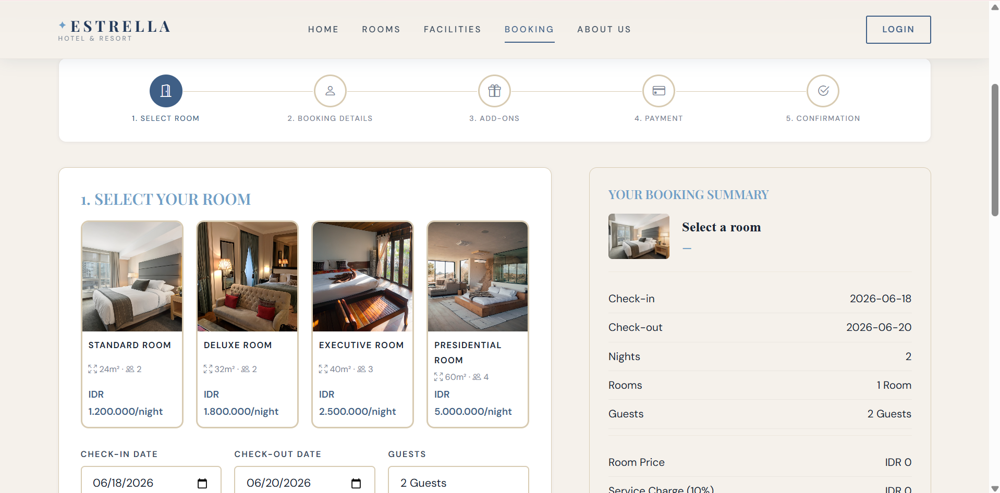
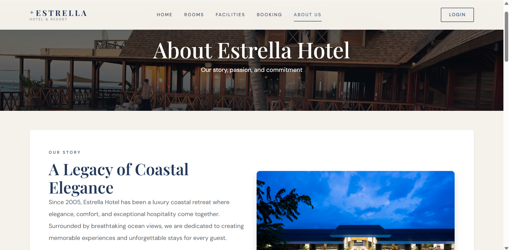
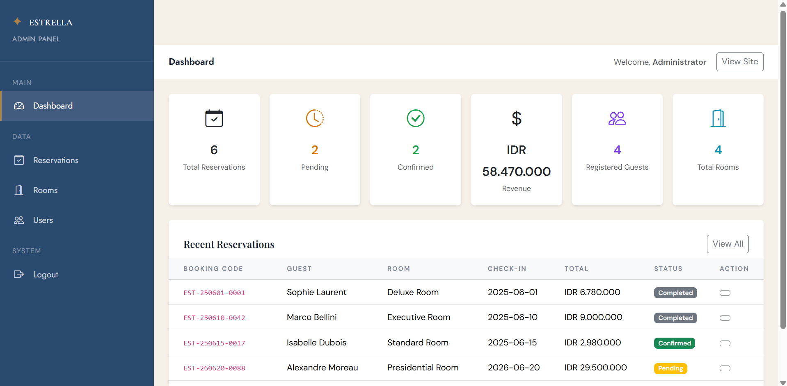
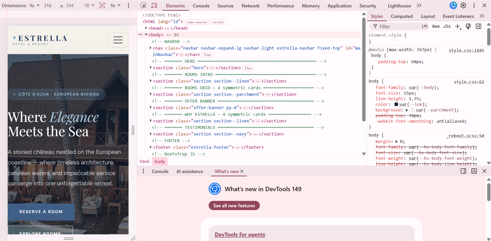

# Estrella Hotel & Resort

> Aplikasi web reservasi hotel mewah berbasis PHP & MySQL — Ujian Akhir Semester  
> Praktikum Pemrograman Web 1 · Praktikum Basis Data  
> Teknologi Rekayasa Perangkat Lunak · Sekolah Vokasi UGM · 2025/2026

---

## Deskripsi Proyek

**Estrella Hotel & Resort** adalah sistem reservasi hotel berbasis web dengan tema *European Coastal Luxury*. Aplikasi ini memungkinkan tamu untuk menjelajahi kamar, membuat reservasi melalui alur pemesanan 5 langkah, serta mengelola riwayat booking mereka. Admin dapat mengelola data kamar, reservasi, dan pengguna melalui panel administrasi.

---

## Fitur Utama

### Guest
- **Beranda** — Hero section, ketersediaan kamar, katalog kamar, penawaran spesial
- **Rooms** — Daftar kamar dengan filter (tipe, kapasitas, harga, pencarian)
- **Room Detail** — Galeri foto, amenitas, tabs detail/fasilitas/kebijakan, booking widget
- **Booking Flow (5 Steps)**:
  1. Pilih kamar
  2. Isi detail pemesanan + ringkasan harga
  3. Pilih add-ons (breakfast, spa, airport transfer, dll)
  4. Pembayaran (credit card, bank transfer, e-wallet, pay at hotel)
  5. Konfirmasi booking dengan kode referensi
- **My Bookings** — Riwayat reservasi, pencarian, batalkan reservasi
- **Facilities** — Halaman fasilitas hotel
- **About Us** — Sejarah, visi misi, timeline, penghargaan, tim
- **Auth** — Login, Register, Logout (session + password_hash)

### Admin
- **Dashboard** — Statistik reservasi, pendapatan, grafik
- **Reservations** — CRUD lengkap: tampil, edit status, hapus + search & pagination
- **Rooms** — CRUD lengkap: tambah, edit, hapus kamar + search & pagination
- **Users** — Daftar pengguna, hapus, search & pagination

---

## Harga Kamar

| Tipe Kamar        | Harga / Malam   | Kapasitas |
|-------------------|-----------------|-----------|
| Standard Room     | IDR 1.200.000   | 2 orang   |
| Deluxe Room       | IDR 1.800.000   | 2 orang   |
| Executive Room    | IDR 2.500.000   | 3 orang   |
| Presidential Room | IDR 5.000.000   | 4 orang   |

Harga belum termasuk service charge 10% dan pajak 10%.

---

## Teknologi

- **Backend**: PHP 8.x, MySQL 8.x
- **Frontend**: Bootstrap 5.3, Bootstrap Icons, Google Fonts (Cormorant Garamond + Jost)
- **Server**: XAMPP / Laragon (Apache + MySQL)
- **Database**: 6 tabel, 2 VIEW, 2 FUNCTION, 2 TRIGGER, 3+ query kompleks

---

## Struktur Folder

```
estrella/
├── assets/
│   ├── css/style.css        ← Custom CSS (tema coastal luxury)
│   └── js/main.js           ← Validasi JS, interaktivitas DOM
├── includes/
│   ├── config.php           ← Koneksi DB + helper functions (EXCLUDE dari git)
│   ├── header.php           ← Navbar responsif
│   └── footer.php           ← Footer
├── pages/
│   ├── about.php
│   ├── booking.php          ← Step 1 & 2
│   ├── booking_addons.php   ← Step 3
│   ├── booking_payment.php  ← Step 4
│   ├── booking_confirm.php  ← Step 5
│   ├── facilities.php
│   ├── login.php
│   ├── logout.php
│   ├── my_bookings.php
│   ├── register.php
│   ├── room_detail.php
│   ├── rooms.php
│   └── admin/
│       ├── dashboard.php
│       ├── reservations.php
│       ├── rooms.php
│       └── users.php
├── index.php                ← Halaman beranda
├── database.sql             ← Export MySQL (struktur + data contoh)
├── .gitignore
└── README.md
```

---

## Cara Menjalankan

### Prasyarat
- XAMPP / Laragon terinstall
- PHP 8.0+
- MySQL 8.0+
- Browser modern

### Langkah Instalasi

1. **Clone / salin** folder proyek ke direktori web server:
   ```bash
   # XAMPP
   C:/xampp/htdocs/estrella/
   
   # Laragon
   C:/laragon/www/estrella/
   ```

2. **Import database**:
   - Buka phpMyAdmin: `http://localhost/phpmyadmin`
   - Buat database baru bernama `estrella_hotel`
   - Klik **Import** → pilih file `database.sql` → klik **Go**

3. **Konfigurasi koneksi** (jika perlu):
   - Buka `includes/config.php`
   - Sesuaikan `DB_HOST`, `DB_USER`, `DB_PASS`, `DB_NAME`

4. **Jalankan aplikasi**:
   - Buka browser: `http://localhost/estrella`

### Akun Default

| Role  | Username | Password |
|-------|----------|----------|
| Admin | `admin`  | `password` |
| Guest | `guest1` | `password` |

> ⚠️ Ganti password default setelah pertama kali login!

---

## Checklist Teknis

### Bootstrap
- [x] Sistem grid Bootstrap (col-*, container, row)
- [x] Navbar responsif dengan collapse di layar mobile
- [x] Minimal 3 komponen: Card, Button, Badge, Alert, Modal, Tabs, Breadcrumb
- [x] Layout valid 375px s.d. 1440px

### JavaScript
- [x] Validasi form JS sebelum submit (login, register, booking, payment, room form)
- [x] Konfirmasi hapus data dengan `confirm()`
- [x] Manipulasi DOM (pesan error inline, toggle elemen, live price update)
- [x] Multiple `addEventListener`: submit, input, change, click, scroll

### PHP & Keamanan
- [x] `htmlspecialchars()` pada seluruh output user input
- [x] `password_hash()` + `password_verify()` untuk autentikasi
- [x] `session_start()` untuk proteksi halaman
- [x] `config.php` dipisah dan di-exclude dari git
- [x] Prepared statements di seluruh query

### CRUD & Database
- [x] **CREATE**: reservasi baru, user baru, tambah kamar
- [x] **READ**: tampil data dari DB (kamar, reservasi, pengguna)
- [x] **UPDATE**: edit status reservasi, edit data kamar
- [x] **DELETE**: hapus reservasi, hapus kamar, hapus user
- [x] Halaman Daftar Data dengan search & pagination

### Database (Basis Data)
- [x] 6 tabel (users, rooms, amenities, room_amenities, reservations, reservation_logs)
- [x] 2 VIEW (v_reservation_summary, v_room_availability)
- [x] 2 FUNCTION (fn_calculate_total, fn_generate_booking_code)
- [x] 2 TRIGGER (trg_after_reservation_insert, trg_after_reservation_update)
- [x] 3+ query kompleks JOIN & subquery

---

## Screenshot

> Letakkan screenshot di folder `assets/img/screenshots/`:
> 1. Beranda (index.php)
> 2. Daftar Kamar (rooms.php)
> 3. Admin Reservations (admin/reservations.php)
> 4. Form Edit Kamar (admin/rooms.php)
> 5. Halaman Mobile (responsive)
> 6. Booking Confirmation (booking_confirm.php)

---

## Lisensi

Proyek ini dibuat untuk keperluan akademis — Ujian Akhir Semester Praktikum Pemrograman Web 1 & Basis Data, Sekolah Vokasi UGM 2025/2026.

## Screenshots

### Halaman Beranda


### Halaman Rooms


### Halaman Facilities


### Halaman Booking


### Halaman About Us


### Admin Panel


### Tampilan Mobile

